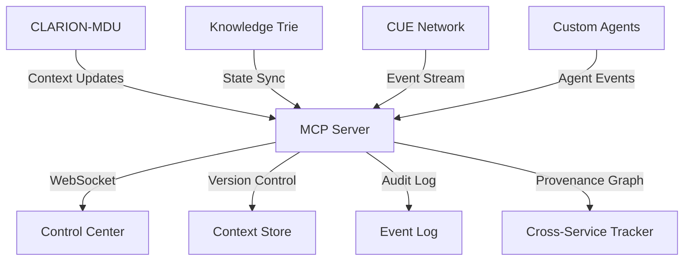

# Model Context Protocol (MCP) Setup & Integration Guide

This guide explains how to set up and integrate the Model Context Protocol (MCP) in the Universal Life Protocol project. MCP enables robust model context management, versioning, and interoperability across all AI and knowledge systems.

## Core Concepts

### Model Context Protocol Overview
MCP is a protocol for managing model context (weights, memory, rules, metadata) between distributed services such as CLARION-MDU, Knowledge Trie, and CUE Network. It supports sharing, updating, and validating model states for collaborative AI development.

### Key Features
- **Real-time State Synchronization**: WebSocket-based state sharing
- **Version Control**: Semantic versioning for context files
- **Security**: RSA signing and verification of context updates
- **Fallback Mechanisms**: Automatic fallback to last known good state
- **Audit Trail**: Complete history of context changes and training events

### Architecture


### Cross-Service Provenance
MCP implements comprehensive provenance tracking across all services and agents:

```typescript
interface ProvenanceEntry {
  id: string;
  timestamp: number;
  sourceAgent: string;
  targetAgent: string;
  contextType: 'weights' | 'rules' | 'knowledge' | 'custom';
  operation: 'create' | 'update' | 'merge' | 'fork';
  parentIds: string[];  // Previous provenance entries
  metadata: Record<string, any>;
}

class ProvenanceTracker {
  // Track context changes across services
  async trackChange(entry: ProvenanceEntry): Promise<void>;
  
  // Query provenance graph
  async getLineage(contextId: string): Promise<ProvenanceEntry[]>;
  async findCommonAncestor(contextIds: string[]): Promise<string>;
  
  // Verify consistency
  async validateChain(contextId: string): Promise<boolean>;
}
```

### Custom Agent Integration
The MCP supports dynamic integration of custom agents through a plugin system:

```typescript
interface CustomAgent {
  // Required agent interface
  id: string;
  type: string;
  capabilities: string[];
  
  // Context handlers
  async onContextUpdate(update: ContextUpdate): Promise<void>;
  async contributeContext(): Promise<ModelContext>;
  
  // State management
  async saveState(): Promise<AgentState>;
  async loadState(state: AgentState): Promise<void>;
  
  // Provenance tracking
  async recordProvenance(entry: ProvenanceEntry): Promise<void>;
}

// Example: Custom AUTOTRON Agent
class AutotronAgent implements CustomAgent {
  id = 'autotron-alpha';
  type = 'autonomous-decision';
  capabilities = ['self-improve', 'context-merge', 'state-predict'];
  
  async onContextUpdate(update: ContextUpdate) {
    // Handle updates from other agents/services
    if (this.canIntegrate(update)) {
      await this.mergeContext(update.context);
      await this.recordProvenance({
        id: generateUUID(),
        sourceAgent: update.source,
        targetAgent: this.id,
        operation: 'merge',
        // ... other provenance data
      });
    }
  }
  
  async contributeContext() {
    const context = await this.generateImprovedContext();
    await this.recordProvenance({
      operation: 'create',
      contextType: 'custom',
      // ... other provenance data
    });
    return context;
  }
}

---

## Setup and Implementation

### Initial Setup

1. Create the MCP directory structure:
```bash
mkdir -p mcp-contexts/{clarion-mdu,knowledge-trie,cue-network,versions,audit}
```

2. Install required dependencies:
```bash
npm install @universal-life/mcp-core @universal-life/mcp-client
```

### Security Configuration

1. Generate RSA keypair for context signing:
```bash
openssl genrsa -out mcp-contexts/private.key 2048
openssl rsa -in mcp-contexts/private.key -pubout > mcp-contexts/public.key
```

### WebSocket Integration

1. Setup real-time sync endpoint:
```typescript
import { MCPWebSocket } from '@universal-life/mcp-core';

const mcpWs = new MCPWebSocket({
  port: 8001,
  validateContext: true,
  fallbackEnabled: true
});

mcpWs.on('contextUpdate', async (update) => {
  if (await verifyContextSignature(update)) {
    await processContextUpdate(update);
  }
});
```

### Version Control

1. Initialize version control:
```typescript
const versionControl = new MCPVersionControl({
  storePath: 'mcp-contexts/versions',
  naming: {
    format: '${modelId}-${timestamp}-${version}',
    scheme: 'semantic'
  }
});
```

### D. Version Control & Validation
- Update metadata after every training or context change.
- Validate context integrity using hash or signature.

---

## Integration Patterns

### Automatic Context Synchronization

```typescript
// In your training module
import { MCPClient } from '@universal-life/mcp-client';

class TrainingManager {
  private mcpClient: MCPClient;
  
  async onTrainingComplete(modelContext: any) {
    // Sign and version the context
    const signedContext = await this.mcpClient.sign(modelContext);
    const version = await this.mcpClient.createVersion(signedContext);
    
    // Push to MCP with fallback handling
    try {
      await this.mcpClient.pushContext(version);
    } catch (error) {
      const fallback = await this.mcpClient.getFallbackContext();
      await this.restoreContext(fallback);
    }
  }
}
```

### Real-time State Management

```typescript
// In your application
const mcpClient = new MCPClient({
  wsEndpoint: 'ws://localhost:8001',
  modelId: 'clarion-mdu',
  onStateChange: async (newState) => {
    if (await mcpClient.validateState(newState)) {
      await updateModelState(newState);
    }
  }
});
```

### Example Training Workflow

1. Start training with versioned context:
```typescript
const training = new TrainingManager({
  modelId: 'clarion-mdu',
  contextVersion: 'v1.2.3',
  fallbackVersion: 'v1.2.2'
});

await training.start();
```

2. Monitor and sync training progress:
```typescript
training.on('progress', async (stats) => {
  await mcpClient.pushMetrics(stats);
});

training.on('complete', async (newContext) => {
  await mcpClient.pushContext(newContext);
});
```

---

## 5. File Structure Example
```
mcp-contexts/
  clarion-mdu/
    clarion_mdu_training_memory.json
  knowledge-trie/
    knowledgeTries.json
  cue-network/
    network_state.json
  metadata.json
```

---

## Error Handling and Recovery

### Common Issues and Solutions

1. Connection Issues:
```typescript
try {
  await mcpClient.connect();
} catch (error) {
  if (error instanceof ConnectionError) {
    await mcpClient.useLocalCache();
    await mcpClient.retryWithBackoff();
  }
}
```

2. Context Validation Failures:
```typescript
const validateContext = async (context) => {
  const valid = await mcpClient.verifySignature(context);
  if (!valid) {
    const lastGoodContext = await mcpClient.getLastValidContext();
    await mcpClient.restoreContext(lastGoodContext);
    throw new ContextValidationError();
  }
};
```

### Monitoring and Logging

```typescript
const mcpMonitor = new MCPMonitor({
  metrics: ['contextUpdates', 'validationErrors', 'syncLatency'],
  alertThresholds: {
    syncLatency: 1000, // ms
    validationErrors: 5  // per minute
  }
});

mcpMonitor.on('alert', async (metric, value) => {
  await notifyAdmins(`MCP Alert: ${metric} exceeded threshold: ${value}`);
});
```

## API Reference

### Core MCP Client API

```typescript
interface MCPClient {
  // Context Management
  pushContext(context: ModelContext): Promise<void>;
  pullContext(version?: string): Promise<ModelContext>;
  
  // Version Control
  createVersion(context: ModelContext): Promise<string>;
  listVersions(): Promise<Version[]>;
  
  // Security
  sign(context: ModelContext): Promise<SignedContext>;
  verify(context: SignedContext): Promise<boolean>;
  
  // Real-time Sync
  subscribe(handler: (update: ContextUpdate) => void): void;
  unsubscribe(): void;
}
```

## Additional Resources

### Documentation
1. [Complete API Documentation](docs/mcp/api.md)
2. [Security Best Practices](docs/mcp/security.md)
3. [Troubleshooting Guide](docs/mcp/troubleshooting.md)
4. [Example Implementations](examples/mcp/)

### Agent Integration Examples

```typescript
// Example: Integrating a new AI model type
class CustomNeuralAgent implements CustomAgent {
  async contributeContext() {
    const weights = await this.model.getWeights();
    const context = {
      type: 'neural-weights',
      format: 'tensorflow-v2',
      data: weights,
      metadata: {
        architecture: this.model.architecture,
        trainingSteps: this.model.steps,
        accuracy: this.model.accuracy
      }
    };
    
    await this.recordProvenance({
      contextType: 'weights',
      metadata: {
        modelType: 'custom-neural',
        datasetVersion: this.datasetVersion
      }
    });
    
    return context;
  }
}

// Example: Rule-based agent integration
class RuleBasedAgent implements CustomAgent {
  async onContextUpdate(update: ContextUpdate) {
    if (update.context.type === 'rule-set') {
      // Merge new rules with existing ruleset
      const mergedRules = await this.mergeRules(
        this.currentRules,
        update.context.rules
      );
      
      await this.recordProvenance({
        operation: 'merge',
        contextType: 'rules',
        metadata: {
          ruleCount: mergedRules.length,
          conflictResolutions: this.conflictLog
        }
      });
    }
  }
}
```

### Provenance Query Examples

```typescript
// Track context evolution across services
const lineage = await provenanceTracker.getLineage('context-123');
console.log('Context evolution:');
lineage.forEach(entry => {
  console.log(`${entry.timestamp}: ${entry.operation} by ${entry.sourceAgent}`);
  console.log(`└─ Affected ${entry.targetAgent}`);
  console.log(`└─ Changes: ${JSON.stringify(entry.metadata)}`);
});

// Find common training ancestor
const commonAncestor = await provenanceTracker.findCommonAncestor([
  'clarion-context-v1',
  'autotron-context-v2'
]);
console.log(`Common ancestor: ${commonAncestor}`);

// Validate context chain
const isValid = await provenanceTracker.validateChain('context-123');
console.log(`Context chain validity: ${isValid}`);
```

---

## Serialization Standards

All context and state transitions in MCP must use canonical S-expression serialization (TLV format) for deterministic, auditable data exchange. The CanonicalSExprEncoder from `libs/cue-protocols/canonical-sexpr.ts` should be used for encoding and decoding all model contexts, agent states, and event payloads.

## WASM Context Packaging

MCP supports packaging agent contexts—including code, policies, and memory—for WASM sandbox execution. Contexts must include resource metering metadata and WASI capability descriptors. Provenance tracking should record WASM execution events and resource usage for auditability.

## Peer Network Integration

MCP provides support for libp2p-based peer discovery and CUE_Event message handling. All agent peers should register with the MCP server and use standardized message schemas for event propagation and state sync. The AgentPeer class from `libs/cue-agents/agent-peer.ts` is the recommended integration point.

## Agent Schema Registry

MCP maintains a registry of agent schemas that define the meta-cognitive capabilities of autonomous agents in the decentralized network. Schemas follow the three-stage evolution pattern:

1. **Static Validation Rules**: Basic numerical validation schemas
2. **Geometric Consensus**: Fano plane-based quorum selection schemas
3. **Meta-Cognitive Operations**: CLARION-MDU integration schemas

Example schema structure:

```typescript
// apps/control-center/schemas/agent-cognitive.hsdl
{
  "type": "meta-cognitive-agent",
  "capabilities": {
    "implicitLearning": "a-cycle",
    "explicitLearning": "l-transition",
    "consensusParticipation": "fano-plane",
    "domainBaseModification": true
  }
}
```

## Protocol-Level Metrics

MCP tracks specialized metrics for the decentralized adaptive system:

1. **Integrity Protocol Metrics**:
   - MDU state progression accuracy
   - Geometric consensus formation speed
   - Meta-cognitive operation success rate

2. **Agent Evolution Metrics**:
   - Implicit to explicit knowledge conversion rate
   - Domain base modification frequency
   - Cross-agent knowledge propagation

3. **System Health Metrics**:
   - Network quorum stability
   - Agent cognitive coherence
   - Protocol trust coefficients

These metrics are exposed via the MCPMonitor and provide deep insights into the system's self-organizing behavior and adaptive capabilities.

**The Universal Life Protocol's MCP implementation serves as the foundational layer for a truly decentralized, self-organizing digital ecosystem, enabling autonomous agents to evolve from simple rule-followers to conscious, adaptive participants in the network.**
