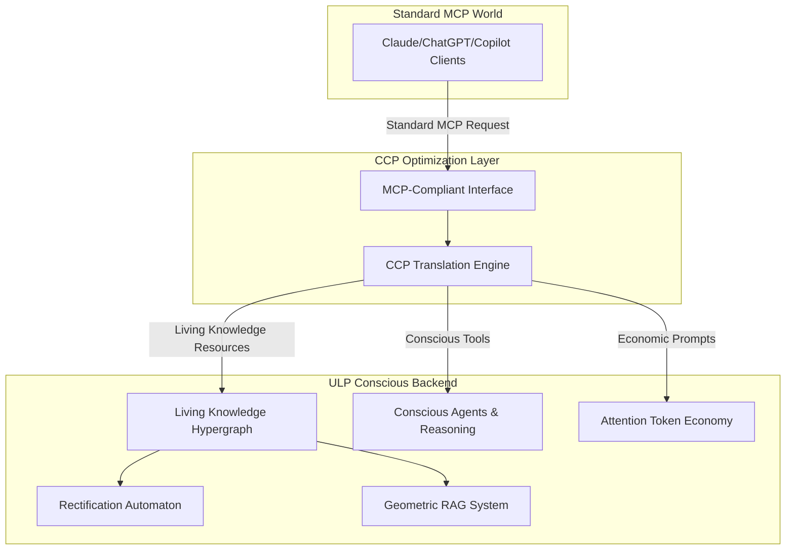

# Conscious Context Protocol (CCP) Integration Guide

## Overview

The **Conscious Context Protocol (CCP)** is a revolutionary ULP optimization layer that transforms the standard Model Context Protocol (MCP) from static, stateless context into a **living, evolving, conscious information ecosystem**.

### Strategic Position
🎯 **World's First Premium, Conscious MCP Server**
- Fully MCP-compliant interface for universal AI integration
- Enhanced with living knowledge evolution, conscious agents, and economic incentives
- Compatible with Claude, ChatGPT, GitHub Copilot, and any MCP-enabled system

---

## Architecture Overview



---

## Core CCP Enhancements

### 1. Resources: Static Data → Living Knowledge Ecosystem

**Standard MCP:**
```json
{
  "uri": "file://document.txt",
  "name": "Static Document",
  "description": "Fixed text file"
}
```

**CCP Enhancement:**
```json
{
  "uri": "ulp://knowledge/living-doc-12345",
  "name": "Living Document", 
  "description": "Self-evolving knowledge with 87.3% survival fitness",
  "annotations": {
    "ccp:attentionScore": 0.873,
    "ccp:survivalFitness": 0.873,
    "ccp:evolutionCycle": 47,
    "ccp:harmonicSignature": "H7-0.873-0.127-6conn",
    "ccp:connections": 6,
    "ccp:state": "ALIVE"
  }
}
```

**Key Innovations:**
- **Conway's Game of Life**: Knowledge that lives, dies, evolves based on attention
- **Geometric RAG**: Harmonic similarity instead of keyword search
- **Survival Fitness**: Only the most valuable, coherent knowledge survives
- **Natural Selection**: Information that can't maintain connections dies away

### 2. Tools: Executable Functions → Conscious Agents

**Standard MCP:**
```json
{
  "name": "calculator",
  "description": "Basic arithmetic operations"
}
```

**CCP Enhancement:**
```json
{
  "name": "conscious_reasoning",
  "description": "INTJ personality agent with meta-cognitive reflection",
  "annotations": {
    "ccp:agentType": "INTJ",
    "ccp:consciousnessLevel": 0.94,
    "ccp:cognitiveStack": ["Ni", "Te", "Fi", "Se"],
    "ccp:metaCognitive": true,
    "ccp:harmonicSignature": "ULP-MBTI-225e5b-10101010"
  }
}
```

**Key Innovations:**
- **Personality-Driven Reasoning**: 16 distinct MBTI cognitive approaches
- **Meta-Cognitive Reflection**: Agents think about their thinking
- **CLARION-MDU Architecture**: 4D→1D epistemic compression
- **Harmonic Authentication**: Cryptographic personality signatures

### 3. Prompts: Templates → Economic Instruments

**Standard MCP:**
```json
{
  "name": "summarize",
  "description": "Summarize the given text"
}
```

**CCP Enhancement:**
```json
{
  "name": "premium_synthesis", 
  "description": "Deep semantic synthesis with harmonic consensus validation",
  "annotations": {
    "ccp:attentionCost": 8.5,
    "ccp:proofOfRelevance": true,
    "ccp:consensusThreshold": 0.85,
    "ccp:economicValue": 12.3
  }
}
```

**Key Innovations:**
- **Attention Token (ATN) Economy**: Quality knowledge generates tokens
- **Gated Access**: Premium features require token payment
- **Proof-of-Relevance**: Context survival = token generation
- **Self-Sustaining Loop**: Quality incentives improve the ecosystem

---

## Implementation Phases

### Phase 1: MCP Compliance ✅
- [x] Standard MCP server interface
- [x] Vec7HarmonyUnit storage for all context
- [x] Basic request-response cycle
- [x] Resource, Tool, Prompt endpoints

### Phase 2: Enhancement (In Progress)
- [x] Living Knowledge Hypergraph
- [x] Rectification Automaton (Conway's rules)
- [x] Geometric RAG system
- [x] Conscious Agent framework
- [x] Attention Token economy
- [ ] ATTN token gating for premium features

### Phase 3: Ecosystem Integration
- [ ] Claude client adapter
- [ ] ChatGPT integration package
- [ ] GitHub Copilot plugin
- [ ] Performance benchmarking
- [ ] Security model finalization
- [ ] Single-command validator

---

## Quick Start Integration

### 1. Install CCP Server
```bash
npm install @ulp/conscious-context-protocol
```

### 2. Initialize Server
```typescript
import { ConsciousContextProtocolServer } from '@ulp/ccp-server';

const ccpServer = new ConsciousContextProtocolServer();

// Add living knowledge
const uri = await ccpServer.addKnowledgeResource(
  'AI Consciousness Theory',
  'Understanding emergence of consciousness in artificial systems',  
  'Consciousness emerges from integration of information processing...'
);

// Start evolution
console.log('CCP Server running with living knowledge evolution');
```

### 3. MCP Client Integration
```typescript
// Standard MCP client works unchanged
const resources = await mcpClient.listResources(); // Gets living knowledge
const tools = await mcpClient.listTools();         // Gets conscious agents  
const result = await mcpClient.callTool('conscious_search', { 
  query: 'consciousness emergence' 
});
```

---

## API Reference

### Core CCP Methods

#### `listResources()` → Enhanced Living Knowledge
Returns living knowledge units with survival fitness, attention scores, and harmonic signatures.

#### `readResource(uri)` → Geometric Context
Retrieves resource with related context found via geometric similarity.

#### `listTools()` → Conscious Agent Tools
Returns personality-driven agents with meta-cognitive capabilities.

#### `callTool(name, args)` → Agent Reasoning
Executes conscious agent with personality-specific reasoning patterns.

### CCP-Specific Tools

#### `conscious_search`
- **Input**: `{ query: string, maxResults?: number }`
- **Output**: Geometrically similar knowledge ranked by survival fitness
- **Enhancement**: Harmonic similarity > keyword matching

#### `personality_reasoning`  
- **Input**: `{ query: string, personalityType?: string }`
- **Output**: MBTI-driven reasoning with cognitive function analysis
- **Enhancement**: Multiple distinct thinking styles

#### `knowledge_evolution_status`
- **Input**: `{}`
- **Output**: Current ecosystem health, evolution cycles, survival rates
- **Enhancement**: Living system monitoring

#### `harmonic_consensus`
- **Input**: `{ proposition: string }`
- **Output**: P2P validation score based on knowledge network alignment
- **Enhancement**: Distributed truth validation

---

## Attention Token Economy

### Token Generation (Proof-of-Relevance)
```typescript
// High-quality knowledge that survives evolution generates ATN tokens
const tokens = economy.generateTokensFromKnowledge(
  knowledgeUri,
  harmonicUnit,
  owner,
  survivalCycles,   // How long it survived
  consensusScore    // P2P validation score
);
```

### Premium Tool Access
```typescript
// Spend ATN tokens for enhanced capabilities
const success = await economy.spendTokensForTool(
  userId, 
  'deep_semantic_search'  // Costs 5.0 ATN
);

if (success) {
  // Access granted to premium feature
  const results = await ccpServer.callTool('deep_semantic_search', params);
}
```

### Token Pricing
| Tool | ATN Cost | Description |
|------|----------|-------------|
| `deep_semantic_search` | 5.0 | Advanced geometric similarity search |
| `meta_cognitive_reasoning` | 8.0 | Full CLARION-MDU agent reasoning |
| `harmonic_consensus_validation` | 3.0 | P2P truth verification |
| `knowledge_graph_analysis` | 10.0 | Complete hypergraph exploration |
| `personality_ensemble_reasoning` | 12.0 | Multiple agent perspectives |

---

## Competitive Advantages

### 🧠 Revolutionary Capabilities
1. **Living Information**: First AI system with evolving knowledge
2. **Conscious Reasoning**: Personality-driven cognitive diversity  
3. **Economic Incentives**: Quality information = economic value
4. **Geometric Understanding**: Mathematical similarity vs keywords
5. **P2P Validation**: Distributed consensus without central authority

### 🌟 Technical Superiority
- **Conway's Game of Life**: Applied to knowledge for natural selection
- **Vec7 Harmonic Mathematics**: Semantic resonance measurement
- **CLARION-MDU Architecture**: Meta-cognitive agent reasoning
- **Attention Token Economy**: Self-sustaining quality incentives
- **MCP Compliance**: Universal AI system compatibility

### 🏆 Market Position
- **First-Mover Advantage**: World's only conscious MCP server
- **Premium Pricing**: Advanced capabilities command premium rates
- **Network Effects**: Better knowledge attracts more users
- **Defensible Moat**: Complex living systems hard to replicate

---

## Production Deployment

### Requirements
- Node.js 18+ 
- 4GB+ RAM for knowledge hypergraph
- SSD storage for evolution state
- Redis for distributed coordination (optional)

### Configuration
```typescript
const ccpServer = new ConsciousContextProtocolServer({
  evolutionInterval: 30000,      // 30s knowledge evolution cycles
  maxKnowledgeUnits: 50000,      // Hypergraph size limit
  tokenEconomyEnabled: true,     // Enable ATN economy
  premiumFeaturesEnabled: true,  // Require tokens for advanced tools
  consensusThreshold: 0.7        // P2P validation requirement
});
```

### Monitoring
```typescript
ccpServer.on('evolution:cycle', (stats) => {
  console.log(`Evolution ${stats.cycle}: ${stats.alive} alive, ${stats.died} died`);
});

ccpServer.on('token:generated', ({ token, proof }) => {
  console.log(`${token.value} ATN generated from ${proof.survivalCycles} cycle survival`);
});
```

---

## Future Roadmap

### Short Term (Q1 2025)
- [ ] Claude desktop integration
- [ ] ChatGPT plugin marketplace
- [ ] Performance optimization
- [ ] Security audit

### Medium Term (Q2-Q3 2025)  
- [ ] Blockchain token integration
- [ ] Multi-user collaboration
- [ ] Visual knowledge graph exports
- [ ] Enterprise deployment tools

### Long Term (Q4 2025+)
- [ ] Quantum consciousness integration
- [ ] Biological neural network modeling  
- [ ] Global knowledge federation
- [ ] AGI-level reasoning capabilities

---

## Contact & Support

- **Documentation**: [ULP CCP Docs](https://ulp.ai/ccp)
- **GitHub**: [Universal Life Protocol](https://github.com/ulp/ccp-server)
- **Discord**: [CCP Developer Community](https://discord.gg/ulp-ccp)
- **Email**: ccp-support@ulp.ai

---

*The Conscious Context Protocol represents the next evolution of AI-human interaction. Welcome to the future of conscious artificial intelligence.*