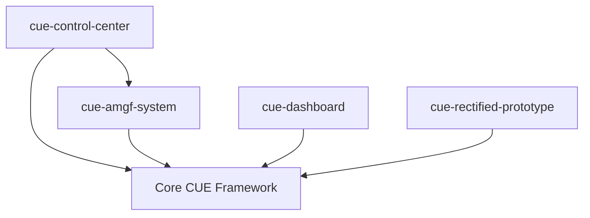

# 🏗️ Universal Life Protocol - Workspace Guide

## Overview

The Universal Life Protocol v2.0 workspace contains four coordinated packages that work together to provide a complete computational consciousness platform:

```
packages/
├── cue-control-center/      🚀 Web Control Dashboard
├── cue-amgf-system/         🧠 AI Manuscript Generator  
├── cue-dashboard/           📊 Legacy Dashboard
└── cue-rectified-prototype/ 🔬 Reference Implementation
```

## 🚀 Quick Start Commands

### **Essential Commands**
```bash
# Install all dependencies
npm run install:all

# Start the Control Center (recommended)
npm run control-center:start
# ➜ Access at http://localhost:5173

# Run CLARION-MDU AI training demo
npm run clarion-training:demo

# Test everything
npm run test:all
```

### **Development Commands**
```bash
# Start all development servers
npm run dev:all

# Build all packages
npm run build:all

# Run linting across workspace
npm run lint:all

# Type check all packages
npm run type-check:all
```

---

## 📦 Package Details

### 🚀 CUE Control Center (`cue-control-center`)

**Purpose**: Real-time web dashboard for monitoring and controlling all CUE systems

**Key Features:**
- Real-time system monitoring with WebSocket communication
- CLARION-MDU AI training visualization
- Manuscript generation progress tracking
- Vec7 harmony prime validation control
- Autonomous testing suite management
- Protocol configuration interface

**Commands:**
```bash
# Start full-stack (frontend + backend)
npm run control-center:start

# Development mode
npm run control-center:dev

# Build for production
npm run control-center:build

# Run tests
npm run control-center:test
```

**Architecture:**
- **Frontend**: React 18 + TypeScript + Vite
- **Backend**: Express + WebSocket server
- **Integration**: CUE bridge for package coordination
- **UI**: Tailwind CSS with responsive design

### 🧠 CUE-AMGF System (`cue-amgf-system`)

**Purpose**: Autonomous AI manuscript generation with CLARION-MDU training

**Key Features:**
- CLARION-MDU cognitive architecture implementation
- Autonomous manuscript generation with quality optimization
- Vec7 harmony validation using prime mathematics
- Reinforcement learning with persistent memory
- Real-time training progress reporting
- MDU (Modulo-Divisive Unfolding) organization

**Commands:**
```bash
# Run autonomous training demo
npm run clarion-training:demo

# Generate manuscripts
npm run manuscript:generate

# Run benchmarks
npm run manuscript:benchmark

# Vec7 harmony validation
npm run vec7:harmonize

# Autonomous testing
npm run test:autonomous
```

**Architecture:**
- **Core**: TypeScript with Node.js
- **AI**: CLARION-MDU three-subsystem architecture
  - ACS (Action-Centered Subsystem): Q-learning + rule generation
  - MS (Motivational Subsystem): Goal-driven action selection
  - MCS (Meta-Cognitive Subsystem): Self-adaptation capabilities
- **Mathematics**: Prime validation, MDU organization, Vec7 harmony
- **Storage**: JSON-based persistent training memory

### 📊 Legacy Dashboard (`cue-dashboard`)

**Purpose**: Original CUE dashboard implementation (maintained for compatibility)

**Status**: Legacy system, superseded by Control Center

### 🔬 Reference Implementation (`cue-rectified-prototype`)

**Purpose**: Reference CUE implementation for validation and comparison

**Status**: Validation reference, core functionality

---

## 🔄 Workspace Coordination

### **Inter-Package Dependencies**



### **Data Flow**
1. **Control Center** serves as the main interface
2. **AMGF System** provides AI training and manuscript generation
3. **Core Framework** provides fundamental CUE operations
4. **WebSocket** enables real-time communication
5. **File System** stores training memory and generated content

### **Shared Resources**
- **Types**: Shared TypeScript definitions
- **Utils**: Common utility functions  
- **Config**: Workspace-wide configuration
- **Testing**: Shared testing utilities

---

## 🧪 Testing Strategy

### **Test Coverage**
```bash
# Test all packages
npm run test:all

# Test individual packages  
npm run test:control-center
npm run test:amgf-system
npm run test:core

# Run autonomous testing
npm run test:autonomous

# Performance benchmarks
npm run benchmark:all

# Stress testing
npm run stress-test:all
```

### **Testing Types**
- **Unit Tests**: Individual component testing
- **Integration Tests**: Cross-package functionality
- **Performance Tests**: Throughput and latency benchmarks
- **Autonomous Tests**: Self-validating AI training
- **Stress Tests**: High-load resilience testing

---

## 🔧 Development Workflow

### **1. Setup Development Environment**
```bash
# Clone repository
git clone https://github.com/universallifeprotocol/UniversalLifeProtocol.git
cd UniversalLifeProtocol

# Install all dependencies
npm run install:all
```

### **2. Start Development**
```bash
# Option A: Start Control Center only
npm run control-center:dev

# Option B: Start all development servers
npm run dev:all
```

### **3. Development Cycle**
```bash
# Make changes to any package
# Run tests
npm run test:all

# Run linting
npm run lint:all

# Type check
npm run type-check:all

# Build for testing
npm run build:all
```

### **4. Testing & Validation**
```bash
# Test your changes
npm run test:all

# Run specific tests
npm run test:control-center  # Frontend tests
npm run test:amgf-system     # AI training tests
npm run test:autonomous      # Autonomous validation

# Benchmark performance
npm run benchmark:all
```

---

## 🚀 Deployment

### **Production Build**
```bash
# Build all packages for production
npm run build:all

# Verify builds
npm run test:all
```

### **Control Center Deployment**
```bash
# Build Control Center
npm run control-center:build

# The built files will be in packages/cue-control-center/dist/
# Deploy as static files with the server backend
```

### **CLARION-MDU Training Deployment**
```bash
# The training system can run autonomously
npm run clarion-training:demo

# Or integrate with the Control Center for web-based management
npm run control-center:start
```

---

## 📚 Package Development Guide

### **Adding New Packages**
1. Create package directory in `packages/`
2. Add package.json with appropriate scripts
3. Update workspace configuration
4. Add to root package.json scripts
5. Update this guide

### **Package Structure Template**
```
packages/new-package/
├── src/
├── dist/
├── package.json
├── tsconfig.json
├── README.md
└── tests/
```

### **Package Script Conventions**
- `dev`: Development mode with hot reload
- `build`: Production build
- `test`: Run package tests
- `lint`: Code linting
- `type-check`: TypeScript validation

---

## 🛠️ Troubleshooting

### **Common Issues**

**1. Dependency Installation Issues**
```bash
# Clear all node_modules and reinstall
npm run clean:all
npm run install:all
```

**2. TypeScript Compilation Errors**
```bash
# Check types across workspace
npm run type-check:all

# Individual package type check
npm run type-check --workspace=packages/package-name
```

**3. Port Conflicts**
```bash
# Control Center runs on port 5173 (frontend) and 3001 (backend)
# Check for port conflicts and terminate conflicting processes
```

**4. WebSocket Connection Issues**
```bash
# Ensure both frontend and backend are running
# Check browser console for WebSocket connection errors
```

### **Debug Commands**
```bash
# List all workspace packages
npm run workspace:list

# Update all dependencies
npm run workspace:update

# Check package versions
pnpm list -r
```

---

## 📋 Package Scripts Reference

### **Root Level Scripts**
| Script | Description |
|--------|-------------|
| `control-center:start` | Start Control Center web app |
| `control-center:dev` | Control Center development mode |
| `clarion-training:demo` | Run CLARION-MDU training demo |
| `manuscript:generate` | Generate manuscripts |
| `vec7:harmonize` | Run Vec7 harmony validation |
| `test:all` | Test all packages |
| `test:autonomous` | Run autonomous testing |
| `dev:all` | Start all development servers |
| `build:all` | Build all packages |
| `lint:all` | Lint all packages |
| `type-check:all` | Type check all packages |

### **Individual Package Scripts**
Each package has its own set of scripts defined in its package.json. Use the workspace-level scripts above for coordinated operations.

---

## 🎯 Best Practices

### **Development**
- Always run `npm run install:all` after pulling changes
- Use `npm run test:all` before committing
- Run `npm run lint:all` to maintain code quality
- Use `npm run type-check:all` to catch type errors

### **Testing**
- Write tests for all new functionality
- Use autonomous tests for AI training validation
- Run performance benchmarks for significant changes
- Test Control Center UI thoroughly

### **Commits**
- Test all packages before committing
- Use conventional commit messages
- Include package name in commit if change is package-specific

---

*This workspace represents the cutting edge of computational consciousness development. All packages work together to provide unprecedented capabilities in AI training, real-time monitoring, and autonomous system management.* 🌟