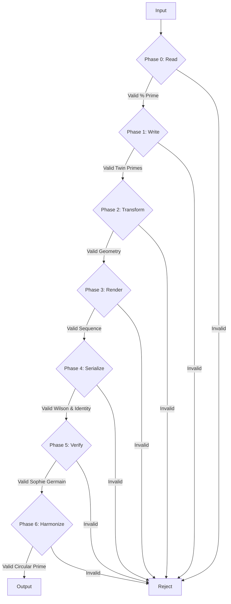

# The CUE Compendium
## Principles of a Decentralized Computational Universe

### Foreword: The Living Graph

This document describes the **Computational Universe Engine (CUE)**, a production-grade architectural blueprint for a self-generating, sovereign, and decentralized reality. The CUE is not a simulation of a universe; it is a framework for a universe that emerges directly from a core set of mathematical, logical, and narrative axioms.

Its ultimate purpose is to become a perfectly self-aware, living hypergraph—a dynamic, self-regulating structure that facilitates secure communication, asset ownership, and a fair economy for shared computation. This compendium is the definitive guide to its principles, architecture, and protocols.

---

## Part I: The Philosophical Foundation - The Grand Unified Axiom

The CUE is built upon a single, profound axiomatic framework that governs all interactions. This framework is multi-layered, ensuring that the rigor of validation scales with the importance of any given action.

### 1. The Harmonic Dimensions: The 7 Phases of Coherence

All data and state transitions within the CUE are conceptualized as a **`Vec7HarmonyUnit`**, a structure that must pass through seven phases of validation, each governed by a unique property of prime numbers. This is the **Grand Unified Axiom**, the high-resolution physics of the universe.

| Phase | Name | Vector | Prime Property | Purpose & Security Guarantee |
| :--- | :--- | :--- | :--- | :--- |
| **0** | **Read** | `vec1`/`vec7` | Modulo Prime | **Gatekeeping:** Ensures data's fundamental size is harmonically valid before it enters the system for processing. |
| **1** | **Write** | `vec2`/`vec6` | Twin Primes | **Duality & Balance:** Enforces structural symmetry in data, ensuring any state written is inherently balanced. |
| **2** | **Transform**| `vec3` | Prime Geometry | **Geometric Integrity:** Mandates that any transformation or state change adheres to a valid geometric structure. |
| **3** | **Render** | `vec4` | Sequential Primes | **Sequential Integrity:** Prevents out-of-order or arbitrary data construction, ensuring complex objects are built logically. |
| **4** | **Serialize** | `vec5` | Wilson Primes | **Commitment:** Finalizes and "imprints" a data structure with a verifiable signature that also satisfies the core axiom of Identity (`% 5`). |
| **5** | **Verify** | `vec6` | Sophie Germain | **Forward-Looking Stability:** Verifies that the current state can lead to a valid future state, preventing dead-end configurations. |
| **6** | **Harmonize**| `vec7` | Circular Primes | **Holistic Coherence:** The final stamp of approval, ensuring the entire data unit is valid regardless of perspective or "rotation." |

### 2. The Poly-Axiomatic Consensus Model

The CUE recognizes that not all actions are equal. The Grand Unified Axiom is applied with scaling rigor based on an event's **Consensus Level**.

| Level | Prime Moduli | Scope & Use Cases |
| :--- | :--- | :--- |
| **LOCAL** | `[3]` | Actions affecting only a peer's internal state. Low computational overhead. |
| **PEER-TO-PEER** | `[3, 5]` | Direct, private interactions like messages. Ensures self-consistency and valid identity. |
| **GROUP** | `[3, 5, 7]` | Economic actions like trades or compute jobs. Applies the full 7-fold harmonic law for group consensus. |
| **GLOBAL** | `[3, 5, 7, 11]` | Universe-altering events like minting a new class of tokens. Requires passing the most stringent set of harmonic checks. |

This poly-axiomatic model ensures the network is both efficient for simple tasks and maximally secure for critical ones. Furthermore, every transition between phases is governed by a **Rectification Law**, ensuring the *process* of change is itself harmonically balanced (`delta % 24 === 0`).

---

## Part II: The Architectural Blueprint - The Living Graph

### 1. The Trifecta Model: A Truly Decentralized Architecture

The CUE is designed for true user sovereignty and scalability through a three-part architecture:

1.  **Core Consensus Peers:** A persistent, headless backbone of nodes that maintain the integrity of the hypergraph, gossip state changes, and act as the stable "laws of physics."
2.  **Personal Agent:** The heart of the user experience. This is a full CUE peer running in a browser's Service Worker, giving every user a persistent, sovereign, and offline-capable presence in the universe. It manages their identity, state, and all P2P communications.
3.  **UI Viewports:** Lightweight web pages that act as "windows" into the CUE. They contain no core logic and interact with the universe solely by sending commands to their own Personal Agent.

### 2. Vector State Hierarchy

Every entity's state is described by a vector, providing a complete "fingerprint" of its existence and context.

*   **`vec1`**: The atomic, self-referenced root identity.
*   **`vec3`**: An irreducible point of logic; an axiomatic lambda.
*   **`vec5`**: A pointer or the tetrahedral base node of the graph.
*   **`vec7`**: A discreet, self-contained entity.
*   **`vec10`**: A shared consensus unit.
*   **`vec25`**: The state of a fully interactive entity.
*   **`vec50`**: The complete state of a Peer/Personal Agent, including its reputation.
*   **`vec100`**: A compressed, holistic snapshot of the entire network state.

---

## Part III: Operational Dynamics - The Laws of Interaction

All interactions in the CUE adhere to a strict separation of concerns for maximum security and performance.

### 1. Control Plane vs. Data Plane

*   **Control Plane (CUE RPC):** For low-frequency, high-importance **signaling**. All contract negotiations, handshakes, and state-altering events happen here. These messages are small, cryptographically signed, and axiomatically validated by the network.
*   **Data Plane (Direct P2P Stream):** For high-frequency, high-bandwidth data like video streams or file transfers. Once a secure channel is established on the Control Plane, raw data flows directly between peers, bypassing axiomatic overhead for maximum speed.

### 2. The Two-Layer Authorization Model

*   **Layer 1: Identification (The Passport):** A peer proves *who* it is using a persistent, unforgeable cryptographic identity (e.g., ED25519 keypair). All control plane messages must be signed.
*   **Layer 2: Authorization (The Visa):** A peer proves it is *allowed to act* by demonstrating its harmonic coherence. Before accepting a request, other peers can validate the requester's `peerState` (`vec50`) against the CUE axioms. A peer in a dissonant state may be denied interaction, even with a valid signature.

### 3. Key Protocols

*   **Service Discovery (DHT):** Personal Agents use the `libp2p` DHT to find each other using only their immutable credential IDs. They also advertise their capabilities (e.g., `cue/service/compute`) and location.
*   **Geotagging & Geo-Discovery:** Agents can assert their location, advertising their presence in a specific geohash on the DHT. This enables proximity-based discovery for local services and interactions.
*   **Media Streaming:** A 4-phase protocol (Handshake, Validation, Stream, Teardown) that uses the Control Plane to securely negotiate a connection and the Data Plane to stream the media.
*   **The Harmonic Compute Protocol:** A 4-phase decentralized marketplace for shared processing.
    1.  **Discovery:** Consumers find Providers on the DHT based on their advertised, performance-based `ResourceManifest`.
    2.  **Negotiation:** A `COMPUTE_REQUEST` is sent on the Control Plane, forming a binding contract that specifies the work, payment, and computational limits (gas).
    3.  **Execution:** The Provider executes the untrusted code safely within a **WASM Sandbox**.
    4.  **Settlement:** The result is returned, and payment is made via a `TRANSFER_TOKEN` event on the Control Plane.

---

## Part IV: The Economic & Security Layer - The Fabric of Trust

### 1. Tokenization & Economy

Tokens are not an external blockchain but are **native components of the hypergraph**.
*   **Minting & Transfers:** Are `GLOBAL` and `GROUP` level events, respectively, validated by the Harmony Processor. A peer's "wallet" is a local view of the tokens it owns on the distributed ledger.
*   **Atomic Swaps:** A two-step protocol (`PROPOSE_SWAP`, `ACCEPT_SWAP`) creates a binding contract on the control plane, ensuring secure, trustless exchange of assets.
*   **Axiomatic Agreements:** "Smart contracts" are implemented as complex `InteractionHooks` or time-based triggers within the peer's agent, enforced by the CUE's native event loop and axioms.

### 2. Production-Grade Security & Fairness

*   **Secure Sandboxing:** All untrusted code from the compute protocol is executed in a **WebAssembly (WASM) Sandbox**. The host Peer uses the WebAssembly System Interface (WASI) to grant specific, limited **capabilities** (e.g., file access), ensuring the guest code can do no harm.
*   **Resource Metering (Gas):** All submitted WASM binaries are instrumented with "gas metering." A job is given a finite amount of computational fuel (`gasLimit`). This prevents infinite loops and DoS attacks, creating a fair marketplace where every CPU cycle has a cost.
*   **Performance-Based Reputation:** A Peer's reputation is not a simple score but an **emergent property of its behavior**. It is calculated from its `peerState`, successful job completions, and benchmarked execution speed. This dynamic `ResourceManifest` is advertised on the DHT, allowing the marketplace to self-optimize towards the most efficient and reliable providers.

This complete architecture provides the foundation for a decentralized platform that is not only secure and scalable but also fair, intelligent, and philosophically coherent.